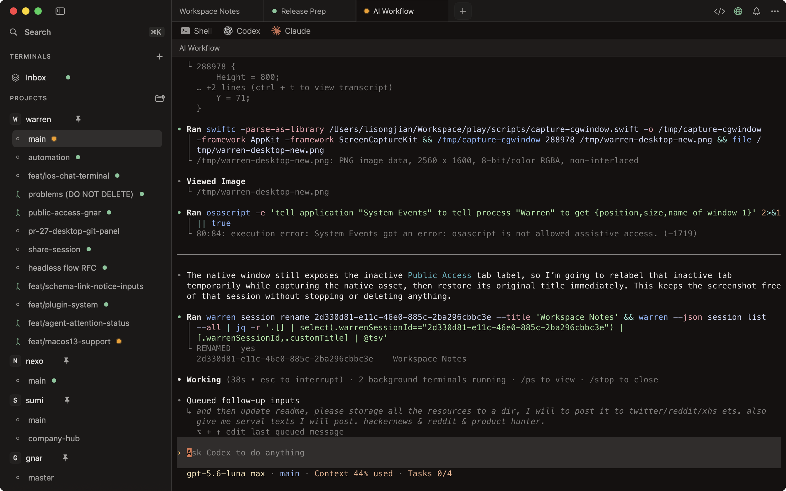
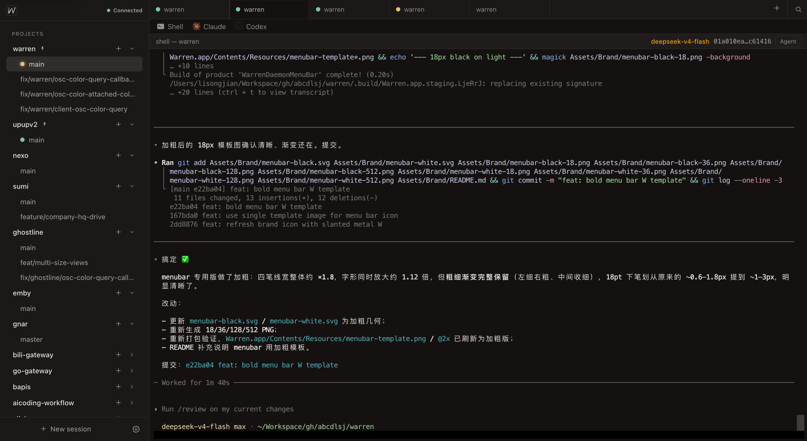
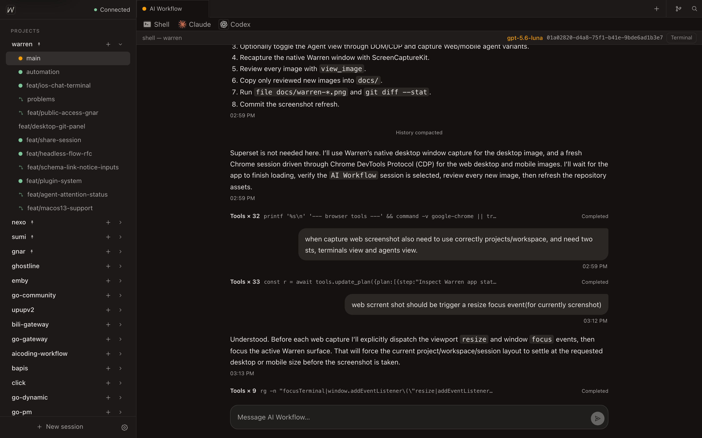
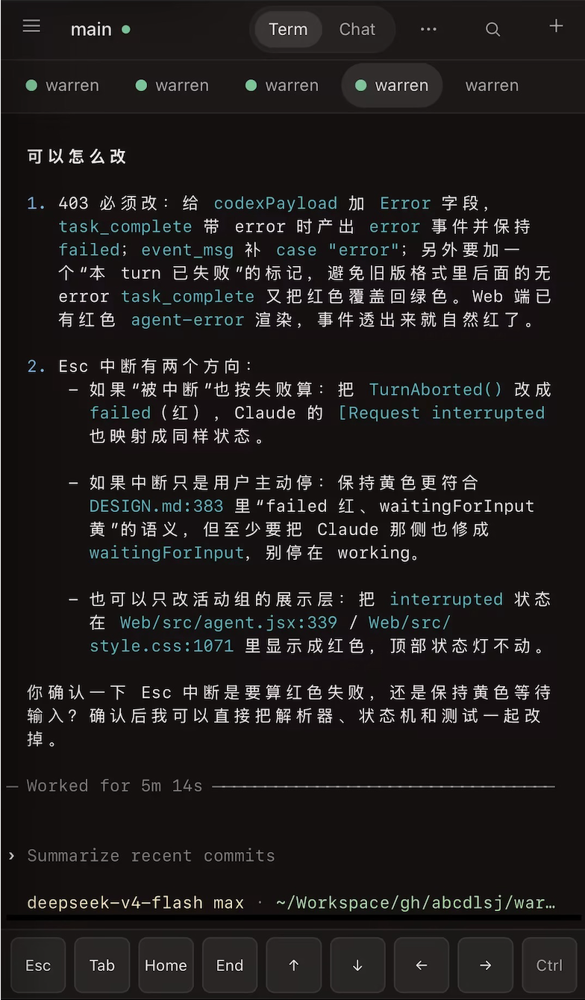
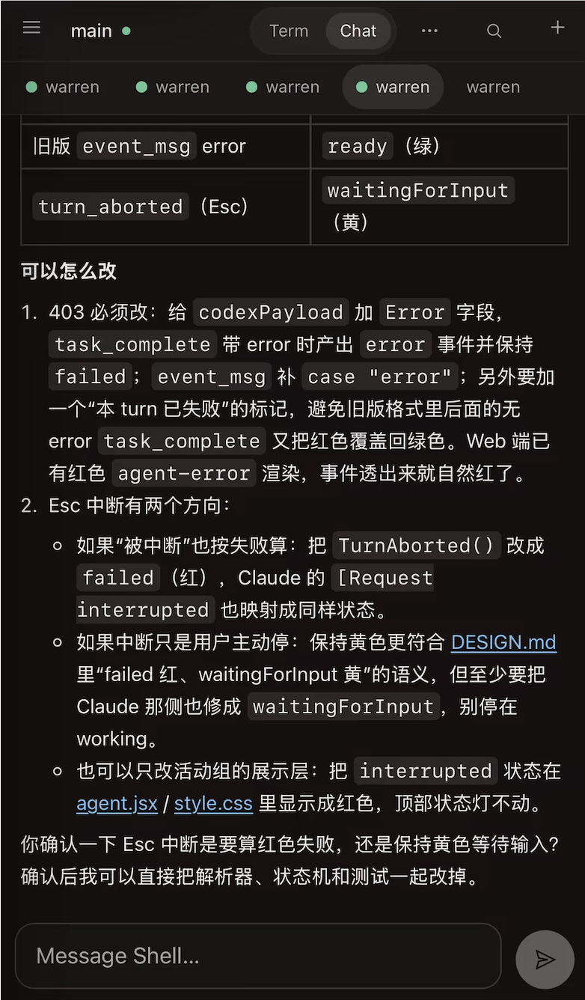

<p align="center">
  
</p>

<h1 align="center">Warren</h1>

Warren is a local-first development workbench organized around **Workspaces**, with durable terminal sessions at its core. Terminal sessions live on a Host — your Mac or a remote VPS — and survive client disconnects, app quits, and network changes. The macOS desktop, CLI, and responsive Web/PWA all talk to the same Host through one versioned protocol.

## Screenshots



### Web

| Terminal | Chat |
| --- | --- |
|  |  |

### Mobile

| Terminal | Chat |
| --- | --- |
|  |  |

## Highlights

- **Durable sessions** — Sessions belong to the Host, not the client. Detaching, switching workspaces, or quitting the app never ends a running session; closing a Tab is the explicit command to end one.
- **One resource model** — Project → Workspace → Terminal Session → Runtime, shared by every client surface.
- **Local and remote** — The desktop connects to the local `warren-headless` daemon by default, or to `warren-headless` on a VPS. SSH only bootstraps the remote daemon and forwards a port; the same versioned WebSocket API is used everywhere.
- **Real terminal fidelity** — Ghostty on macOS and xterm.js on the Web preserve ANSI, OSC, Unicode, and colors from shells, Codex, Claude, and TUIs.
- **Structured agent views** — Codex and Claude transcripts are projected as normalized events on the Web, so agent sessions can render as a conversation without losing the terminal fallback.
- **Workspace-first Git support** — Projects, main checkouts, and Git worktrees are first-class resources; one-time onboarding can import your existing Superset metadata.
- **Optional central control plane** — The Relay Service provides Host registration, pairing, revocation, and outbound WSS forwarding without storing terminal output or user input.
- **Observability-first acceptance** — Tests use semantic UI snapshots and typed intents: no screenshots, no mouse movement, no focus stealing.

## Repository Layout

| Path | What it is |
| --- | --- |
| `Sources/Warren/` | macOS desktop app (SwiftUI + Ghostty) |
| `Packages/` | Domain, client core, desktop, ghostty adapter, protocol, terminal renderer, transport, state store, design-system, and observation packages |
| `Headless/` | Go headless daemon (`warren-headless`) and CLI (`warren`) |
| `RelayService/` | Go Relay control plane |
| `Web/` | React + Vite Web/PWA client |
| `Onboarding/` | Cloudflare Worker onboarding site (React + Vite + Ghostty WASM) |
| `Assets/Brand/` | App icon, menubar templates, and brand assets |
| `docs/` | Architecture and screenshot assets |

## Getting Started

Prerequisites:

- macOS 14+
- Swift 6 toolchain (Xcode)
- Go 1.25
- tmux
- [mise](https://mise.jdx.dev) for the task runner

Build and run the macOS app:

```sh
mise install
mise run dev
```

The app bundle includes the `warren` CLI. On its first launch Warren installs
it to `~/.local/bin` and adds that directory to the active shell profile when
needed. Use `Tools > Install CLI` to reinstall it manually.

### Raycast terminal launcher

Warren registers the `warren://terminal?group=Inbox` URL for external
launchers. Release app bundles include an optional Raycast Script Command and
its Warren icon, but Warren does not install either file or modify Raycast
settings automatically.

After installing Warren at `/Applications/Warren.app`, install the launcher
for the current user:

```sh
mkdir -p "$HOME/.warren"
install -m 755 \
  "/Applications/Warren.app/Contents/Resources/warren-terminal.sh" \
  "$HOME/.warren/warren-terminal.sh"
install -m 644 \
  "/Applications/Warren.app/Contents/Resources/warren-terminal.png" \
  "$HOME/.warren/warren-terminal.png"
```

Then open Raycast **Settings → Script Commands → Add Script Directory**, add
`~/.warren`, and search for **Warren Terminal**. The command can be given the
alias `terminal` or a global hotkey from Raycast's **Configure Command** menu.

When working from a source checkout, use the same commands with
`Support/Raycast/warren-terminal.sh` and `Assets/Brand/warren-app-icon.png` as
the two source paths.

### Settings links

Warren also accepts `warren://settings` links. Each Settings section has a
stable `section` value, for example:

```text
warren://settings?section=public-access
```

The Public Access **Copy setup link** action can include the Edge URL, account
name, and the selected Invite Key or Approval Key so another Warren Desktop can
open the right page with the setup fields prefilled:

```text
warren://settings?section=public-access&edgeUrl=<EDGE_URL>&accountName=<ACCOUNT>&keyKind=invite&inviteKey=<SECRET>
```

Because this link contains the bootstrap secret, treat it like a credential.
Browser history, chat systems, and macOS LaunchServices may retain it; share it
only with the intended developer and rotate the key in gnar when it is no
longer needed.

Warren checks GitHub Releases in the background at launch, no more than once
every three hours. When a newer
macOS app is available, a banner below the workspace tabs offers to download
and install it; the Warren application menu always performs a fresh check.

Build the headless daemon and CLI:

```sh
mise run build:headless
```

Run the Web client in development:

```sh
mise run web:dev
```

Try the one-command local Relay experience:

```sh
mise run relay:dev
```

## Common Tasks

| Command | Description |
| --- | --- |
| `mise run dev` | Build and run the macOS app |
| `mise run build` | Build the macOS app |
| `mise run test` | Run the macOS app unit tests |
| `mise run test:headless` | Run headless daemon and CLI tests |
| `mise run verify` | Build, run all package tests, build the app, and verify the Web bundle |
| `mise run verify:web` | Launch the app and verify the HTTP page plus WebSocket auth/roster |
| `mise run web:dev` | Run the Vite development server |
| `mise run web:build` | Build the Vite Web client into `Web/dist` |
| `mise run relay:dev` | Start a local Relay, connect Warren, and open Remote Web |
| `mise run relay:pair` | Generate and open another Remote Web pairing URL |
| `mise run relay:status` | Show local Relay and Host presence |
| `mise run relay:stop` | Stop the local Relay without quitting Warren or terminal sessions |
| `mise run brand:assets` | Regenerate macOS and Web brand assets |
| `mise run package` | Build a release app and package a zip |

## Brand

The icon is a slanted straight-line `W` with silver metallic highlights on a
charcoal rounded tile. Source files, colors, and regeneration steps live in
[Assets/Brand/README.md](Assets/Brand/README.md).

## Documentation

- [DESIGN.md](DESIGN.md) — product and system design, domain model, architecture, and acceptance criteria
- [GLOSSARY.md](GLOSSARY.md) — shared terminology
- [docs/terminal-rendering-runbook.md](docs/terminal-rendering-runbook.md) — terminal black screen and missing text troubleshooting
- [docs/headless-architecture.md](docs/headless-architecture.md) — headless and remote connection architecture
- [docs/project-architecture-and-customization-guide.md](docs/project-architecture-and-customization-guide.md) — source-audited architecture tutorial and customization guide
- [docs/startup-performance-governance.md](docs/startup-performance-governance.md) — cold-start critical path, deferral rules, and review checklist
- [docs/update-service.md](docs/update-service.md) — Cloudflare release proxy, caching, and updater endpoint contract
- [docs/runtime.md](docs/runtime.md) — ghostline and tmux runtime comparison
- [Headless/README.md](Headless/README.md) — headless daemon and CLI
- [RelayService/README.md](RelayService/README.md) — Relay control plane
- [Web/README.md](Web/README.md) — Web/PWA client
- [Assets/Brand/README.md](Assets/Brand/README.md) — brand and icon assets

## Contributors

<a href="https://github.com/abcdlsj" title="abcdlsj">
  
</a>
