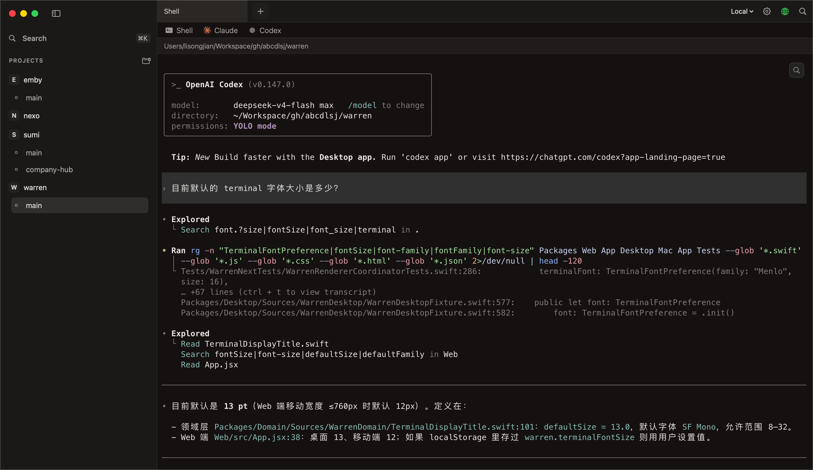
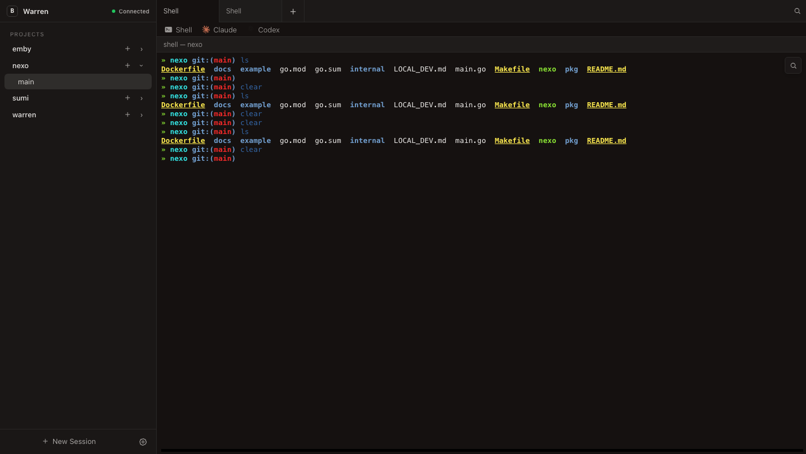
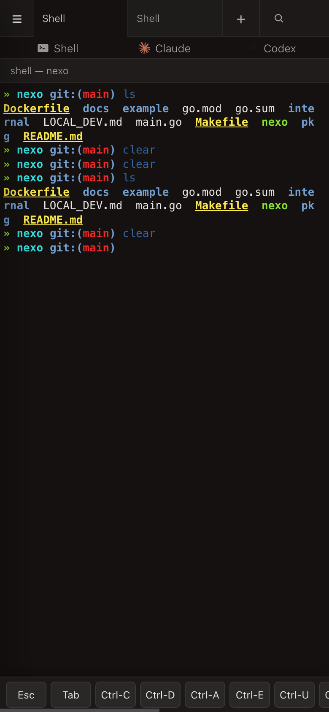

# Warren

Warren is a local-first development workbench organized around **Workspaces**, with durable terminal sessions at its core. Terminal sessions live on a Host — your Mac or a remote VPS — and survive client disconnects, app quits, and network changes. The macOS desktop, CLI, and responsive Web/PWA all talk to the same Host through one versioned protocol.

## Screenshots







## Highlights

- **Durable sessions** — Sessions belong to the Host, not the client. Detaching, switching workspaces, or quitting the app never ends a running session; closing a Tab is the explicit command to end one.
- **One resource model** — Project → Workspace → Terminal Session → Runtime, shared by every client surface.
- **Local and remote** — The desktop connects to an in-process Local Host by default, or to `warren-headless` on a VPS. SSH only bootstraps the daemon and forwards a port; the same versioned WebSocket API is used everywhere.
- **Real terminal fidelity** — Ghostty on macOS and xterm.js on the Web preserve ANSI, OSC, Unicode, and colors from shells, Codex, Claude, and TUIs.
- **Structured agent views** — Codex and Claude transcripts are projected as normalized events on the Web, so agent sessions can render as a conversation without losing the terminal fallback.
- **Workspace-first Git support** — Projects, main checkouts, and Git worktrees are first-class resources; one-time onboarding can import your existing Superset metadata.
- **Optional central control plane** — The Relay Service provides Host registration, pairing, revocation, and outbound WSS forwarding without storing terminal output or user input.
- **Observability-first acceptance** — Tests use semantic UI snapshots and typed intents: no screenshots, no mouse movement, no focus stealing.

## Repository Layout

| Path | What it is |
| --- | --- |
| `Sources/WarrenNext/` | macOS desktop app (SwiftUI + Ghostty) |
| `Packages/` | Domain, application, host, tmux runtime, protocol, transport, and design-system packages |
| `Headless/` | Go headless daemon (`warren-headless`) and CLI (`warren`) |
| `RelayService/` | Go Relay control plane |
| `Web/` | React + Vite Web/PWA client |
| `Assets/Brand/` | App icon and brand assets |
| `docs/` | Architecture and screenshot assets |

## Getting Started

Prerequisites:

- macOS 14+
- Swift 6 toolchain (Xcode)
- Go 1.25
- tmux
- [mise](https://mise.jdx.dev) for the task runner

Build and run the macOS app:

```sh
mise install
mise run dev
```

Build the headless daemon and CLI:

```sh
mise run build:headless
```

Run the Web client in development:

```sh
mise run web:dev
```

Try the one-command local Relay experience:

```sh
mise run relay:dev
```

## Common Tasks

| Command | Description |
| --- | --- |
| `mise run dev` | Build and run the macOS app |
| `mise run build` | Build the macOS app |
| `mise run test` | Run the macOS end-to-end test |
| `mise run test:headless` | Run headless daemon and CLI tests |
| `mise run test:application` | Run application package tests |
| `mise run verify` | Build, run all package tests, build the app, and verify the Web bundle |
| `mise run verify:web` | Launch the app and verify the HTTP page plus WebSocket auth/roster |
| `mise run web:dev` | Run the Vite development server |
| `mise run web:build` | Build the Vite Web client into `Web/dist` |
| `mise run relay:dev` | Start a local Relay, connect Warren, and open Remote Web |
| `mise run relay:pair` | Generate and open another Remote Web pairing URL |
| `mise run relay:status` | Show local Relay and Host presence |
| `mise run relay:stop` | Stop the local Relay without quitting Warren or tmux |
| `mise run brand:assets` | Regenerate macOS and Web brand assets |
| `mise run package` | Build a release app and package a zip |

## Documentation

- [DESIGN.md](DESIGN.md) — product and system design, domain model, architecture, and acceptance criteria
- [GLOSSARY.md](GLOSSARY.md) — shared terminology
- [docs/headless-architecture.md](docs/headless-architecture.md) — headless and remote connection architecture
- [Headless/README.md](Headless/README.md) — headless daemon and CLI
- [RelayService/README.md](RelayService/README.md) — Relay control plane
- [Web/README.md](Web/README.md) — Web/PWA client
- [Assets/Brand/README.md](Assets/Brand/README.md) — brand and icon assets
